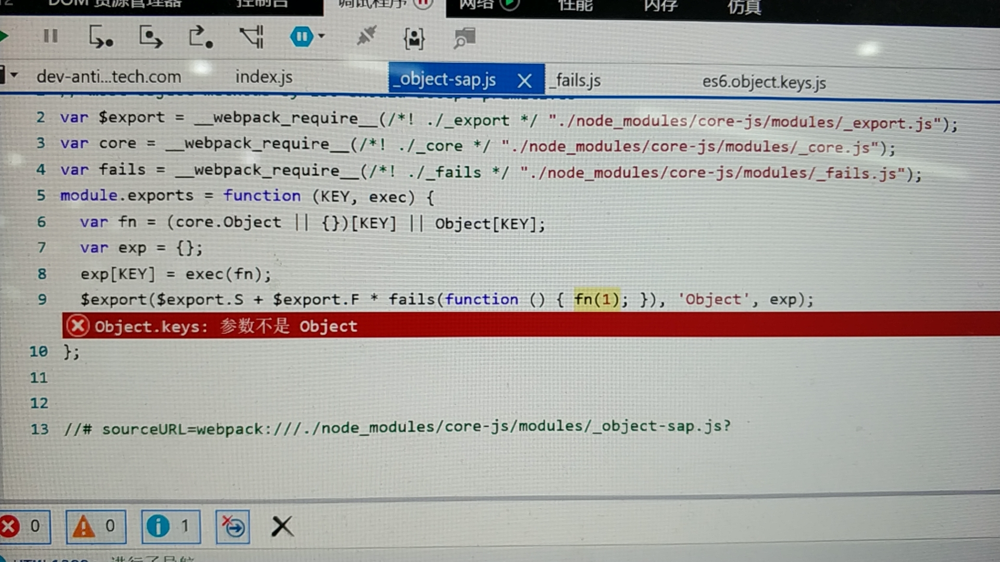
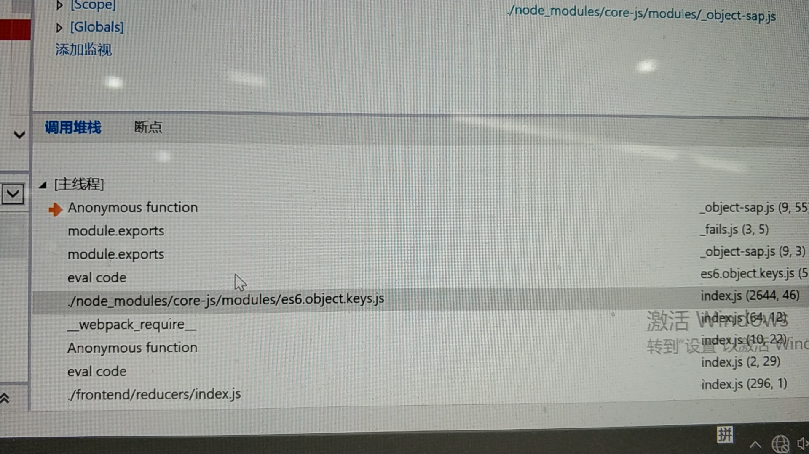

# 笔记 - React+Webpack 兼容IE11 配置

## 背景：

项目开发依赖 react16.x, antd4.x

项目打包构建依赖 webpack4.x babel6.x

项目一直在 chrome 上运行正常，但是最近由于业务需求，需要项目能够跑在 ie11 上，因此开启一段让我有些许头大的ie11兼容之旅。。

## 方案一 : 

1. 在webpack.config.js 的入口配置中添加 babel-polyfill

```
entry: {
	index: [
		'babel-polyfill',
		'./frontend/index.js'
	]
}
```

2. 在 .babelrc 文件中配置 babel-preset-env

```
{
	"presets": [
		[
			"env", {
				"targets": {
					edge: "17",
					firefox: "60",
					chrome: "67",
					safari: "11.1",
					ie: "11"
				}
			},
			useBuiltIns: "usage"
		],
		"es2015",
		"stage-3",
		"stage-2"
	],
	"plugins": [
		"import",
		{
			"libraryName": "antd",
			"libraryDirectory": "es",
			"style": "css"
		}
	],
	"transform-decorators-legacy",
	["react-hot-loader/babel"]
}
```

遇到问题：

以上配置打包后，在 IE 11 中运行时报错，IE 11 页面空白。报错信息如下：



堆栈信息：



看了一下堆栈，应该是 core-js 下面的代码在运行时报错，并且以上截图中报错的代码段 `fn(1)`, 此时的`fn` 是 Object.getprototype 方法，改方法接收一个 Object 类型的参数，可是此时实参是 `1`, 因此报错。

本来以为是 babel 的版本太低了，然后把编译依赖改为 @babe/core, @babel/cli, @babel/polyfill, @babel/preset-env. 结果也还是上述问题。

后面看到这个地址 https://github.com/babel/babel-loader/issues/171 ，个人猜测可能是有些引用到的三方包也需要 babel 转码，而webpack配置中 exclude 指定了 node_modules，导致三方依赖包没有被降级处理。该猜测没有验证过。另外考虑到要把需要转码的三方包都找出来，工作量成本有点高。于是最终采用方案二


## 方案二：

使用 create-react-app 脚手架创建脚手架项目，基于脚手架项目做 ie11 兼容，然后把业务代码移植到脚手架项目中。结果验证可行。

参考 

> https://segmentfault.com/a/1190000021480321

1. 在项目的入口文件中引入以下两个文件（一定要在文件首行引入）

```
import "react-app-polyfill/ie11"
import "react-app-polyfill/stable"
```

2. 在 package.json 文件中的 browserslist 中添加 ie11

```
"browserslist": {
	"production": [
		">0.2%",
		"not dead",
		"not op_mini all",
		"ie 11"
	],
	"development": [
		"last 1 chrome version",
		"last 1 firefox version",
		"last 1 safari version",
		"ie 11"		
	]
}
```

配置完成后，删除 node_modules, 重新安装一遍依赖包，然后在 IE11 中打开验证，是ok的

根据引用文档中的描述，如果 create-react-app 的版本是 3.3.0的话，还需要在 `./node_modules/react-dev-utils/webpackHotDevClient.js:60` 增加 `slashes: true`

我自己用的 create-react-app 的版本是 3.4.1， 所以忽略了这一步

3. 修改 webpack 配置

由于项目本身有一些配置，比如 alias, less-loader. 这些配置项create-react-app 中默认是不包含的，因此需要对 webpack 的配置项做定制化

3.1 https://github.com/timarney/react-app-rewired